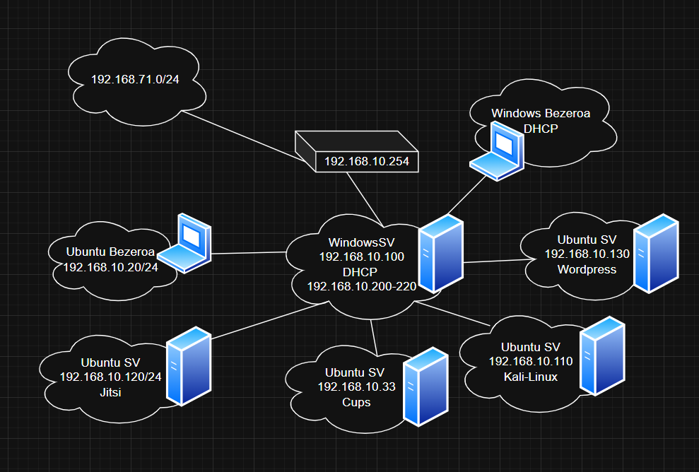

# Sarea

IP-ak:\

DNS:192.168.10.100 (WS-ko IPa) Puerta Enlace: 192.168.10.254 (Mikrotik)

WindowsSV - 192.168.10.100/24

WindowsBezero1 - 192.168.10.200/24 (DHCP erabiliz)

UbuntuBezero - 192.168.10.20/24

Jitsi - 192.168.10.120/24

Cups (Inpresora) - 192.168.10.33/24

Inpresora Erizaintza - 192.168.10.30/24

Inpresora Informatika - 192.168.10.31/24

Inpresora Mekanika - 192.168.10.32/24

Wordpress - 192.168.10.130/24

Kali-LINUX - 192.168.10.110/24\
\
Gure Sare eskema

DHCP

Equipoak IP automatiko dekotenak (192.168.10.200 - 192.168.10.210) artean izango dute

Adibidez: Windows bezeroa 192.168.10.200 ip-a deko, DNS 192.168.10.100 eta Puerta de Enlace 192.168.10.254 da (Mikrotik birtuala erabiliz)\

.png>)

.png>)

DNS

Erabili dut Jitsi zerbitzua ip-aren ordez bilatzeko izen batekin.

Adibidez: jitsi.uni.eus erabaki dut erabiltzeko, 192.168.10.120 da jitsi zerbitzuaren ip-a

.png>)

.png>)

.png>)
